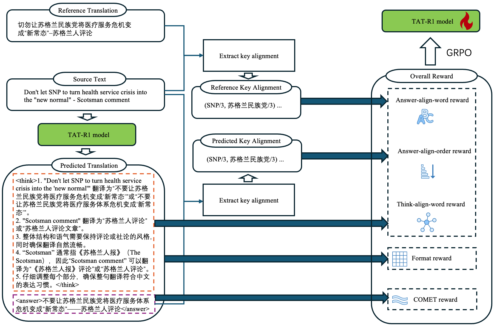

<h1>TAT-R1: Terminology-Aware Translation with Reinforcement Learning and Word Alignment</h1>

## Overview
We propose TAT-R1, the first terminologyaware translation model trained with RL and word alignment rewards. Leveraging word alignment, we design three simple yet effective reward functions for terminology translation model training.

👷Note that this repository is still under construction, and more content will be added soon.

## Results

\begin{table*}[]
	\centering
	\scriptsize
	\renewcommand\arraystretch{1.2}
	\begin{tabular}{p{4cm}|cccc|cccc}
		\hline
		\multirow{2}{*}{\textbf{Models}} & \multicolumn{4}{c|}{\textbf{ZH-\textgreater{}EN}} & \multicolumn{4}{c}{\textbf{EN-\textgreater{}ZH}} \\ \cline{2-9} 
		& \multicolumn{1}{c|}{\textbf{BLEU}} & \multicolumn{1}{c|}{\textbf{COMETKiwi}} & \multicolumn{1}{c|}{\textbf{XCOMET}} & \textbf{Avg.} & \multicolumn{1}{c|}{\textbf{BLEU}} & \multicolumn{1}{c|}{\textbf{COMETKiwi}} & \multicolumn{1}{c|}{\textbf{XCOMET}} & \textbf{Avg.} \\ \hline
		Qwen2.5-7B-Instruct & \multicolumn{1}{c|}{22.18} & \multicolumn{1}{c|}{73.08} & \multicolumn{1}{c|}{86.05} & 60.44 & \multicolumn{1}{c|}{37.36} & \multicolumn{1}{c|}{71.65} & \multicolumn{1}{c|}{75.46} & 61.49 \\ \hline
		SFT & \multicolumn{1}{c|}{22.15} & \multicolumn{1}{c|}{73.98} & \multicolumn{1}{c|}{86.27} & 60.80 & \multicolumn{1}{c|}{33.42} & \multicolumn{1}{c|}{68.58} & \multicolumn{1}{c|}{75.19} & 59.06 \\ \hline
		RL-$R_{comet}$ & \multicolumn{1}{c|}{22.32} & \multicolumn{1}{c|}{77.51} & \multicolumn{1}{c|}{88.59} & 62.80 & \multicolumn{1}{c|}{36.12} & \multicolumn{1}{c|}{75.79} & \multicolumn{1}{c|}{79.42} & 63.78 \\ \hline
		RL-$R_{comet}+R_{BLEU}$ & \multicolumn{1}{c|}{25.08} & \multicolumn{1}{c|}{75.83} & \multicolumn{1}{c|}{87.62} & 62.84 & \multicolumn{1}{c|}{40.98} & \multicolumn{1}{c|}{71.33} & \multicolumn{1}{c|}{77.08} & 63.13 \\ \hline
		RL-$R_{comet}+R_{aaw}$ & \multicolumn{1}{c|}{23.90} & \multicolumn{1}{c|}{77.39} & \multicolumn{1}{c|}{88.37} & 63.22 & \multicolumn{1}{c|}{39.05} & \multicolumn{1}{c|}{73.52} & \multicolumn{1}{c|}{78.51} & 63.69 \\ \hline
		RL-$R_{comet}+R_{aaw}+R_{aao}$ & \multicolumn{1}{c|}{23.97} & \multicolumn{1}{c|}{77.21} & \multicolumn{1}{c|}{88.27} & 63.15 & \multicolumn{1}{c|}{38.53} & \multicolumn{1}{c|}{74.94} & \multicolumn{1}{c|}{78.65} & 64.04 \\ \hline
		RL-$R_{all}$ (TAT-R1) & \multicolumn{1}{c|}{24.40} & \multicolumn{1}{c|}{77.20} & \multicolumn{1}{c|}{88.38} & \textbf{63.33} & \multicolumn{1}{c|}{39.45} & \multicolumn{1}{c|}{75.57} & \multicolumn{1}{c|}{78.65} & \textbf{64.56} \\ \hline
	\end{tabular}
	\caption{Performance on WMT23 ZH to EN and WMT24 EN to ZH testset. ZH represents Chinese and EN represents English. \textit{Avg.} represents the average of BLEU, COMETKiwi and XCOMET metrics.}
	\label{performance_of_wmt}
\end{table*}

\begin{table}[]
	\centering
	\scriptsize
	\renewcommand\tabcolsep{0.8pt}
	\renewcommand\arraystretch{1.2}
	\begin{tabular}{l|ccccc}
		\hline
		\multirow{2}{*}{\textbf{Models}} & \multicolumn{5}{c}{\textbf{EN-\textgreater{}DE}} \\ \cline{2-6} 
		& \multicolumn{1}{c|}{\textbf{BLEU}} & \multicolumn{1}{c|}{\textbf{COMETKiwi}} & \multicolumn{1}{c|}{\textbf{XCOMET}} & \multicolumn{1}{c|}{\textbf{TA}} & \textbf{Avg.} \\ \hline
		Qwen2.5-7B-Instruct & \multicolumn{1}{c|}{25.87} & \multicolumn{1}{c|}{67.05} & \multicolumn{1}{c|}{88.65} & \multicolumn{1}{c|}{53.29} & 58.72 \\ \hline
		SFT & \multicolumn{1}{c|}{0.00} & \multicolumn{1}{c|}{-} &\multicolumn{1}{c|}{-} & \multicolumn{1}{c|}{0.08} & - \\ \hline
		RL-$R_{comet}$ & \multicolumn{1}{c|}{24.52} & \multicolumn{1}{c|}{70.26} & \multicolumn{1}{c|}{90.17} & \multicolumn{1}{c|}{54.42} & 59.84 \\ \hline
		RL-$R_{comet}$+$R_{BLEU}$ & \multicolumn{1}{c|}{27.37} & \multicolumn{1}{c|}{66.49} & \multicolumn{1}{c|}{88.77} & \multicolumn{1}{c|}{54.91} & 59.39 \\ \hline
		RL-$R_{comet}$+$R_{aaw}$ & \multicolumn{1}{c|}{26.21} & \multicolumn{1}{c|}{71.33} & \multicolumn{1}{c|}{90.56} & \multicolumn{1}{c|}{55.57} & 60.92 \\ \hline
		RL-$R_{comet}$+$R_{aaw}$+$R_{aao}$ & \multicolumn{1}{c|}{26.34} & \multicolumn{1}{c|}{72.04} & \multicolumn{1}{c|}{90.99} & \multicolumn{1}{c|}{55.73} & 61.28 \\ \hline
		\begin{tabular}[c]{@{}c@{}}RL-$R_{all}$ (TAT-R1) \end{tabular} & \multicolumn{1}{c|}{27.10} & \multicolumn{1}{c|}{\textbf{73.82}} & \multicolumn{1}{c|}{\textbf{91.22}} & \multicolumn{1}{c|}{\textbf{56.42}} & \textbf{62.14} \\ \hline
	\end{tabular}
	\caption{Performance on RTT testset. DE represents the German language. \textit{Avg.} represents the average of BLEU, COMETKiwi, XCOMET and TA metrics.}
	\label{performance_of_rtt}
\end{table}
