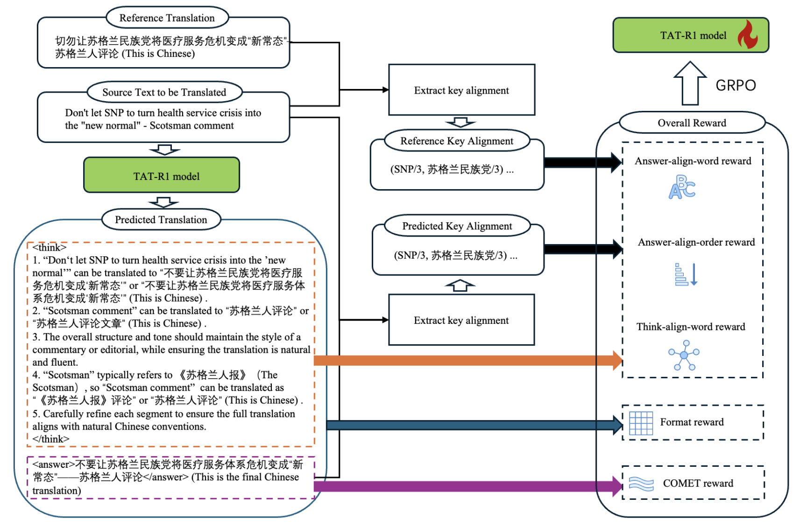
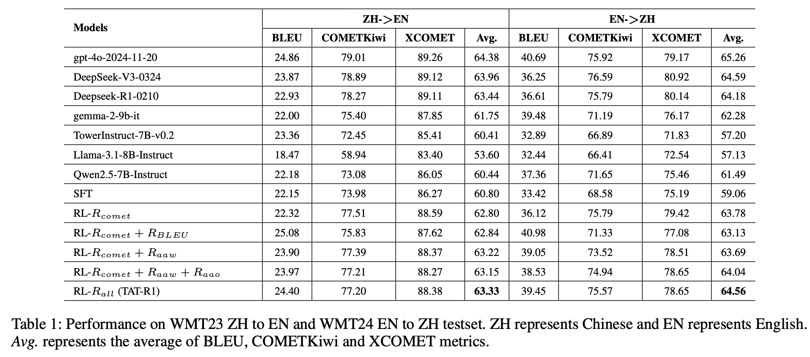
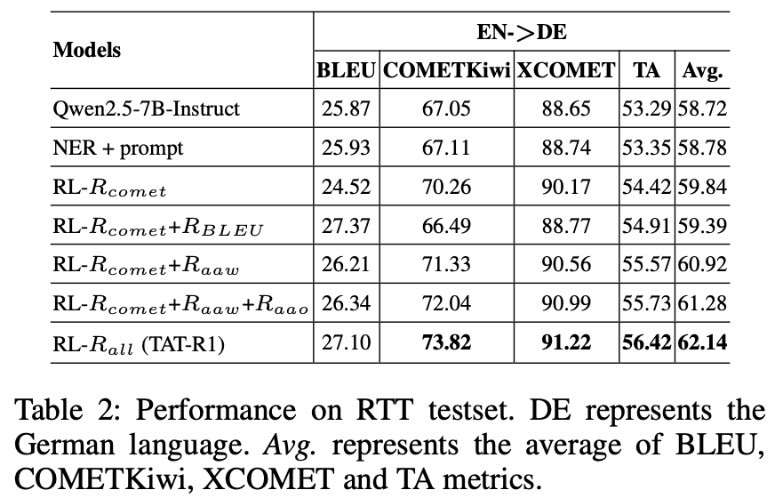
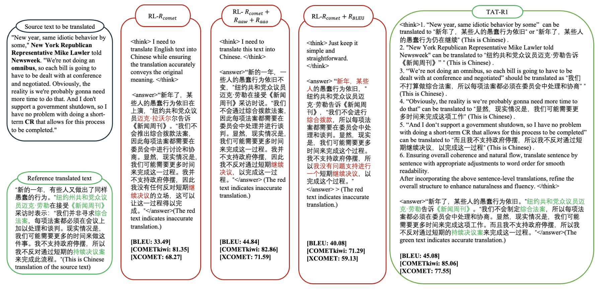

<h1>TAT-R1: Terminology-Aware Translation with Reinforcement Learning and Word Alignment</h1>

## Overview
We propose **TAT-R1**, the first terminologyaware translation model trained with RL and word alignment rewards. Leveraging word alignment, we design three simple yet effective reward functions for terminology translation model training.

👷Note that this repository is still under construction, and more content will be added soon.

## Results

### Performance on WMT23 ZH to EN and WMT24 EN to ZH testset

### Performance on RTT testset

## Case Study

